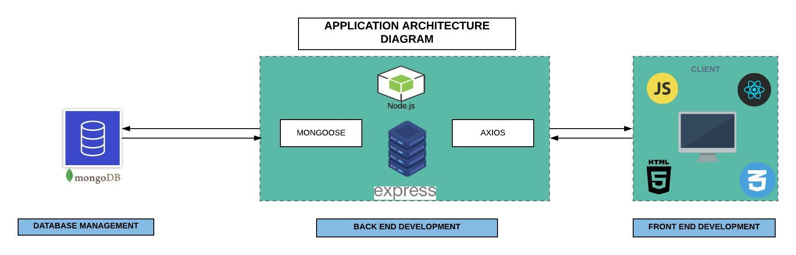
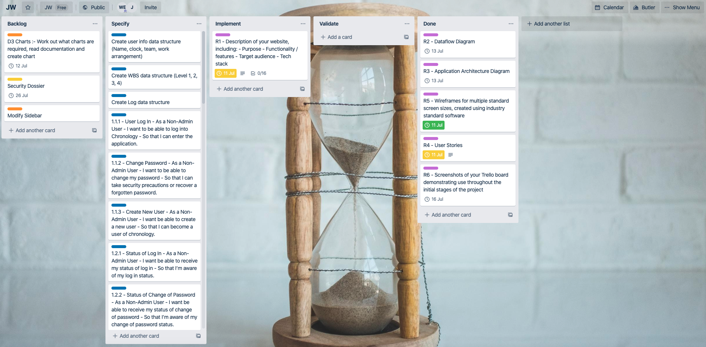

# T3A2-A - Full Stack App (Part A)

A MERN Project - created by: Wilson Esmundo & Jeb Williams

To view in Heroku  
Please click [here](https://chronology-tech.herokuapp.com/)  
Url : https://chronology-tech.herokuapp.com/  

Github Repository  
Please click [here](https://github.com/charliegucci/chronology)  
Url : https://github.com/charliegucci/chronology  

 
## Table of Contents

- [Description of the website](#Description-of-the-website)
  - [Purpose](#Purpose)
  - [Functionality and features](#Functionality-and-features)
  - [Target Audience](#Target-Audience)
  - [Tech Stack](#Tech-Stack)
- [Data Flow Diagram](#Data-Flow-Diagram)
- [Application Architecture Diagram](#Application-Architecture-Diagram)
- [User Stories](#User-Stories)
- [Wireframes for multiple standard screen sizes created using industry standard software](#Wireframes-for-multiple-standard-screen-sizes-created-using-industry-standard-software)
- [Screenshots of your Trello board demonstrating use throughout the initial stages of the project](#Screenshots-of-your-Trello-board-demonstrating-use-throughout-the-initial-stages-of-the-project)

## Description of the website

---

### Purpose

Time tracking is necessary and provides a crucial insight on business or organisation. It helps employees record the progress of their work and for the company, they will be able to know which is best for productivity, to highlight which projects are at work and taking up too much employee time. It also helps manager decide the risk versus reward of spending time on each project. Time tracking also increases accountability which is a major component of a team success. It ensures that each member of your team feels the importance and value of the project that they undertake. It also provides transparency to the company. Mostly, managers allocate work for their employees to complete but they often know very little about the work progress. With time tracking, they will be able to know how long they are taking to get the work done and highlights which other tasks are being neglected. Time tracking also improves scheduling and employees morale. It can actually reinforce feelings of trust and respect in your employees and can improve their performance and overall productivity.

### Features and Functionality

Chronology will have the following features included in the initial release to provide a comprehensive coverage of the time tracking process:

1. Log in and log out of the application securely
2. Change password securely
3. Create a new user securely
4. Select a single WBS (Work Breakdown Structure) from a unified WBS list
5. Input hours for a corresponding WBS and provide daily and weekly aggregations
6. Authenticate users time track
7. Authenticate and reject subordinate time track
8. Allow managers to view aggregated information about subordinate time tracking through tables and charts

The Chronology application will aim provide simple and intuitive functionality for the input, management and visualisation of time tracking data.  The features listed above will function as follows:

1.  A user with the intention to log in to the Chronology application will be required to enter a username and password. Once the user has enter the application they will be routed to the user profile page where they are given information on their current and previous successful log ins, as well as other user specific information.

2. If a user has either forgotten their password, has attempted to log in 5 times without success or requires a password change for any other reason, the user will be directed to the change password page and will allowed to change their password securely. Once the user has successfully changed their password, they will be notified of their success and change of password information will then be recorded for security.

3. On creation of a new user, the user will be required to input their user information into the new user displayed page.  Once all of the information is in required fields and the user has submitted, the user's superior will then be required to approve the new user via an email link.  The user will then be notified of the successful submission and be able access the application.

4. A user will need to be able to allocate and record the hours they have accrued during the work day.  A WBS (Work Breakdown Structure) code will be provided through an interface for the user to select the correct WBS corresponding with the time the user has allocated to an individual task.  

5. On selection of a WBS, the user will then be required to input the hours the have accrued for that specific WBS code.  They will also have the option to select if the task was accrued at some multiplying factor such as 1.5 (time and a half) or 2.5 (double time and a half).  The user will then need to select the day to which the WBS and hour combination occurred (ie. Monday).  As this process takes place, the application will update the current aggregation of hours for daily and weekly totals for the user to view.

6. Once the user has complete the input of WBS and hour combined data for the week, the user will then have the option to submit.  On submission, the users supervisor will then be able to review, reject or authentic the users time track.  

7. If the superior decided to reject the time track, the user will then be required to modify and re-submit, following a similar process to the example above.  The superior will have the option to provide comments to the user on the required modifications.  On authentication, the user will be notified of the superiors authentication.  The authentication will then be passed to the next level of authentication for review, reject or authentication if required.

8. To make effective management decisions, a manager will be able to view a variety of charts and tables of aggregated information related to the organisations time track.  The frames of reference for the charting information can be changed by the manager as required.  The business may also decide to make this information available to subordinate which can be modified at the managers discretion.

---
### Target Audience

The target audience for Chronology is aimed at mid to large scale enterprises who require an integrated and systematic time tracking application for day-to-day operations.

---
### Tech Stack

---

| Tech Stack                                       | Description                                                                                                                                                          |
| :----------------------------------------------- | :------------------------------------------------------------------------------------------------------------------------------------------------------------------- |
|                        | document database with the scalability and flexibility that you want with the querying and indexing that you need                                                    |
|                    | web framework that let's you structure a web application to handle multiple different http requests at a specific url                                                |
|                          | an open-source JavaScript library for building user interfaces                                                                                                       |
|                          | a JavaScript runtime built on Chrome's V8 JavaScript engine                                                                                                          |
|                      | Delivering your transactional and marketing emails through the cloud-based email delivery platform.                                                                  |
|                | easy to use React Bootstrap 4 components compatible with React 16+                                                                                                   |
|                    | an object data modeling (ODM) library that provides a rigorous modeling environment for your data                                                                    |
|                              | a compact URL-safe means of representing claims to be transferred between two parties                                                                                |
|                        | a platform as a service (PaaS) that enables developers to build, run, and operate applications entirely in the cloud                                                 |
|  | set of express.js middlewares that wraps validator.js validator and sanitizer functions                                                                              |
|                            | a mechanism that uses additional HTTP headers to tell browsers to give a web application running at one origin, access to selected resources from a different origin |
|                          | Promise based HTTP client for the browser and node.js                                                                                                                |

## Data Flow Diagram

---

## Application Architecture Diagram

---

## User Stories

---

| Data Flow Process | Function                        | User                       | Action                                                                                  | Result                                                                                           |
| :---------------- | :------------------------------ | :------------------------- | :-------------------------------------------------------------------------------------- | :----------------------------------------------------------------------------------------------- |
| 1.1.1             | User Login                      | As a Non-Admin User        | I want to be able to log into Chronology                                                | So that I can enter the application.                                                             |
| 1.1.2             | Change Password                 | As a Non-Admin User        | I want to be able to change my password                                                 | So that I can take security precautions or recover a forgotten password.                         |
| 1.1.3             | Create New User                 | As a Non-Admin User        | I want be able to create a new user                                                     | So that I can become a user of chronology.                                                       |
| 1.2.1             | Status of Log in                | As a Non-Admin User        | I want be able to receive my status of log in                                           | So that I’m aware of my log in status.                                                           |
| 1.2.2             | Status of Change of Password    | As a Non-Admin User        | I want be able to receive my status of change of password                               | So that I’m aware of my change of password status.                                               |
| 1.2.3             | Status of Create New User       | As a Non-Admin User        | I want be able to receive my status of creating a new user                              | So that I’m aware of creation of new user status.                                                |
| 2.1.1             | Select WBS                      | As a Non-Admin User        | I want to be able to select the correct WBS                                             | So that I can identify the type of completed in my workday.                                      |
| 2.1.2             | Hours                           | As a Non-Admin User        | I want to be able to select the correct hours (normal, 1.5, 2.5, crib)                  | So that I can allocate hours against the corresponding WBS.                                      |
| 2.1.3             | Authentication                  | As a Non-Admin User        | I want to be able to authenticate my timesheet                                          | So that my supervisor and my manager and I can verify my timesheet.                              |
| 2.1.4             | User Entry Information          | As a Non-Admin User        | I want to my user entry information entered automatically                               | So that the correct user information is entered into the database.                               |
| 2.2.1             | Notify User of Success          | As a Non-Admin User        | I want be able to receive a notification of a successfully of authenticated timesheet   | So that I know if my timesheet is successfully authenticated.                                    |
| 2.2.2             | Notify User of Failure          | As a Non-Admin User        | I want be able to receive a notification of a unsuccessfully of authenticated timesheet | So that I know if my timesheet is unsuccessfully authenticated.                                  |
| 3.1.1             | Supervisor/Manager Rejection    | As a Supervisor or Manager | I want to be able to reject the timesheets of subordinates                              | So that the subordinate can modify the timesheet to the correct information.                     |
| 3.1.2             | User Rejection Information      | As a Supervisor or Manager | I want my user information and my subordinates user information entered automatically   | So that the correct user information is entered into the database.                               |
| 3.2.1             | Notify User of Rejection        | As a Supervisor or Manager | I want to be able to send rejection information to the subordinate                      | So that the subordinate can modify the timesheet to the correct information as soon as possible. |
| 3.2.2             | User Authentication Information | As a Supervisor or Manager | I want my user information and my subordinates user information entered automatically   | So that the correct user information is entered into the database.                               |
| 3.2.2             | Notify User of Authentication   | As a Supervisor or Manager | I want notification of authentication of a timesheet                                    | So that I’m aware of the status of authentication.                                               |
| 4.1.1             | Chart Parameters                | As a Manager               | I want to be able to change my chart parameters                                         | So that I can view the required chart information.                                               |
| 4.1.2             | TableParameters                 | As a Manager               | I want to be able to change my table parameters                                         | So that I can view the required table information.                                               |
| 4.2.1             | Display Chart                   | As a Manager               | I want to be able to view my chart                                                      | So that I can make better business decisions.                                                    |
| 4.2.2             | Display Table                   | As a Manager               | I want to be able to view my table                                                      | So that I can make better business decisions.                                                    |
| Null              | Null                            | As an Admin User           | I want to be able to perfrom administrative tasks                                       | So that the application performs as required.                                                    |

## Wireframes for multiple standard screen sizes created using industry standard software

### Desktop Version

---

  
  
  
  
  
  

### Tablet Version

---

  
  
  
  
  
  

### Mobile Version

---

  
  
  
  

## Screenshots of your Trello board demonstrating use throughout the initial stages of the project

---

  
  
  
