# T3A2-A - Full Stack App (Part A)

A MERN Project - created by: Wilson Esmundo & Jeb Williams

To view in Heroku  
Please click [here](https://chronology-tech.herokuapp.com/)  
Url : https://chronology-tech.herokuapp.com/  

Github Repository  
Please click [here](https://github.com/charliegucci/chronology)  
Url : https://github.com/charliegucci/chronology  

## Table of Contents

- [Description of the website](#Description-of-the-website)
  - [Purpose](#Purpose)
  - [Functionality and features](#Functionality-and-features)
  - [Target Audience](#Target-Audience)
  - [Tech Stack](#Tech-Stack)
- [Data Flow Diagram](#Data-Flow-Diagram)
- [Application Architecture Diagram](#Application-Architecture-Diagram)
- [User Stories](#User-Stories)
- [Wireframes for multiple standard screen sizes created using industry standard software](#Wireframes-for-multiple-standard-screen-sizes-created-using-industry-standard-software)
- [Screenshots of your Trello board demonstrating use throughout the initial stages of the project](#Screenshots-of-your-Trello-board-demonstrating-use-throughout-the-initial-stages-of-the-project)

## Description of the website

---

### Purpose

Time tracking is necessary and provides a crucial insight on business or organisation. It helps employees record the progress of their work and for the company, they will be able to know which is best for productivity, to highlight which projects at work and taking too much employee time. It also provides managers to decide the risk versus reward of spending time on each project. Time Tracking also increase the accountability which is a major component of a team success. It ensures that each member of your team feels the importance and invaluable of the project that they undertake. It also provides transparency to the company. Mostly, managers allocate work for their employees to complete but they often know very little about the work progress. With time tracking, they will be able to know how long they are taking to get the work done and highlights which other tasks are being neglected. Time tracking also improves scheduling and employees morale. It can actually reinforce feelings of trust and respect in your employees that can improve their performance and overall productivity.

### Functionality / features

### Target Audience

### Tech Stack

---

| Tech Stack                                       | Description                                                                                                                                                          |
| :----------------------------------------------- | :------------------------------------------------------------------------------------------------------------------------------------------------------------------- |
|                        | document database with the scalability and flexibility that you want with the querying and indexing that you need                                                    |
|                    | web framework that let's you structure a web application to handle multiple different http requests at a specific url                                                |
|                          | an open-source JavaScript library for building user interfaces                                                                                                       |
|                          | a JavaScript runtime built on Chrome's V8 JavaScript engine                                                                                                          |
|                      | Delivering your transactional and marketing emails through the cloud-based email delivery platform.                                                                  |
| 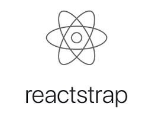               | easy to use React Bootstrap 4 components compatible with React 16+                                                                                                   |
|                    | an object data modeling (ODM) library that provides a rigorous modeling environment for your data                                                                    |
|                              | a compact URL-safe means of representing claims to be transferred between two parties                                                                                |
|                        | a platform as a service (PaaS) that enables developers to build, run, and operate applications entirely in the cloud                                                 |
|  | set of express.js middlewares that wraps validator.js validator and sanitizer functions                                                                              |
|                            | a mechanism that uses additional HTTP headers to tell browsers to give a web application running at one origin, access to selected resources from a different origin |
|                          | Promise based HTTP client for the browser and node.js                                                                                                                |

## Data Flow Diagram

## Application Architecture Diagram

## User Stories

---

| User                    | Description                                                                                                                      |
| :---------------------- | :------------------------------------------------------------------------------------------------------------------------------- |
| All Users               | must to be able to select Work Breakdown Structures so they can identify worked completed during the work day                    |
| All Users               | must be able to enter relevant hours accrued by Work Breakdown Structures so that they can allocate the hours to the correct WBS |
| All Users               | must be able to add WBS and accrued hours to list of daily accrued task                                                          |
| All Users               | must be able to view total accrued hours per day                                                                                 |
| All Users               | must be able to view total accrued hours per week                                                                                |
| All Users               | must be able to select time and a half                                                                                           |
| All Users               | must be able to select double time                                                                                               |
| All Users               | must be able to auto calculate CRIB                                                                                              |
| All Users               | must be able to authenticate own timesheet                                                                                       |
| Level 2 and 3 Users     | must be able to authenticate subordinate timesheet                                                                               |
| Level 2 and 3 Users     | must be able to reject subordinate timesheet                                                                                     |
| All Users               | should be able to see their metadata                                                                                             |
| All Users               | must be able to see their weekly metadata                                                                                        |
| Level 4 and Admin Users | must be able to see aggregation information                                                                                      |
| All Users               | must be able to login and logout based on their privileges                                                                       |
| Admin Users             | must be able to perform admin task                                                                                               |
| Level 4 and Admin Users | must be able to see Chart based on aggregation                                                                                   |

## Wireframes for multiple standard screen sizes created using industry standard software

### Desktop Version

---

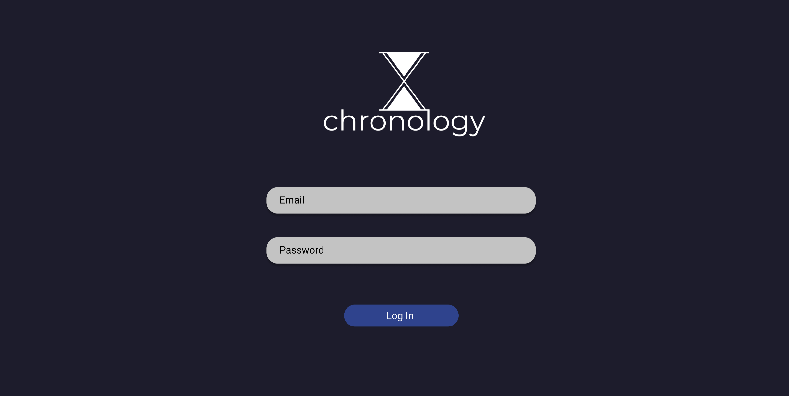  
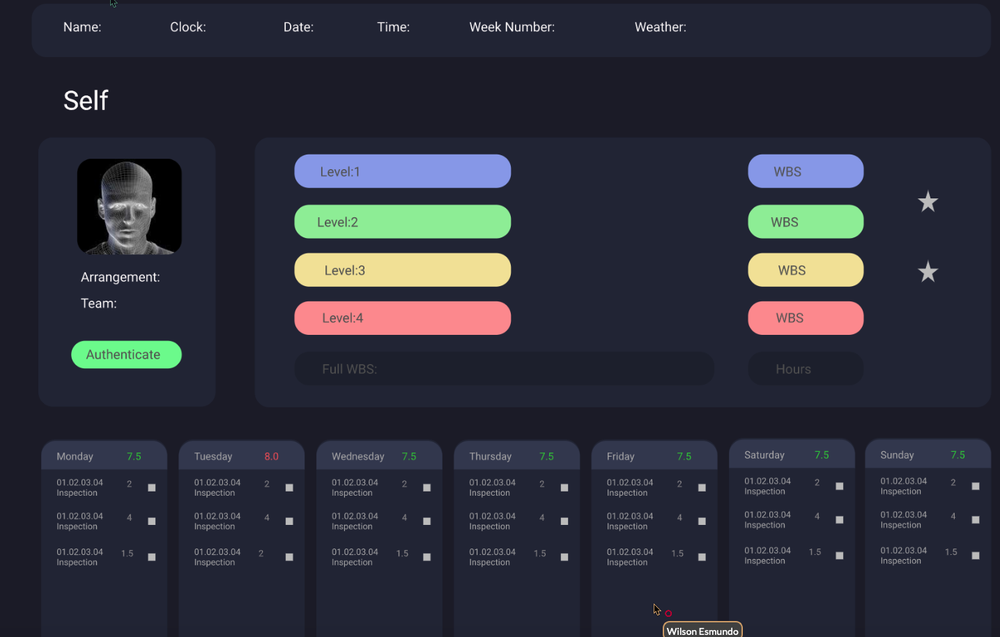  
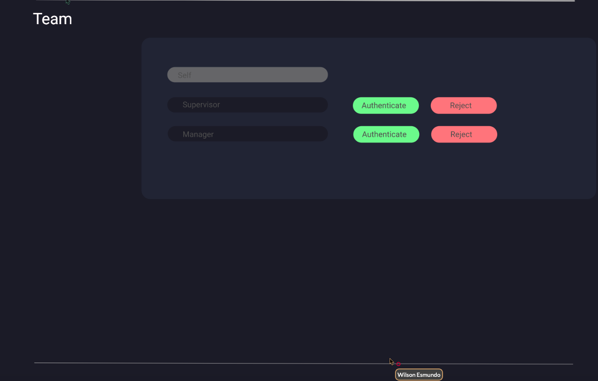  
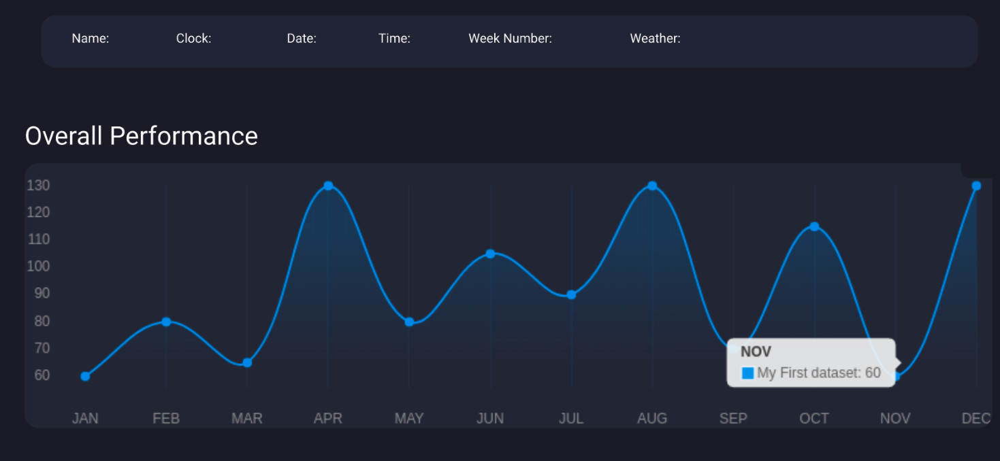  
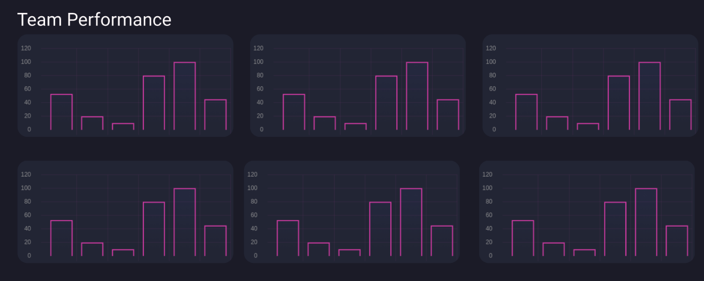  
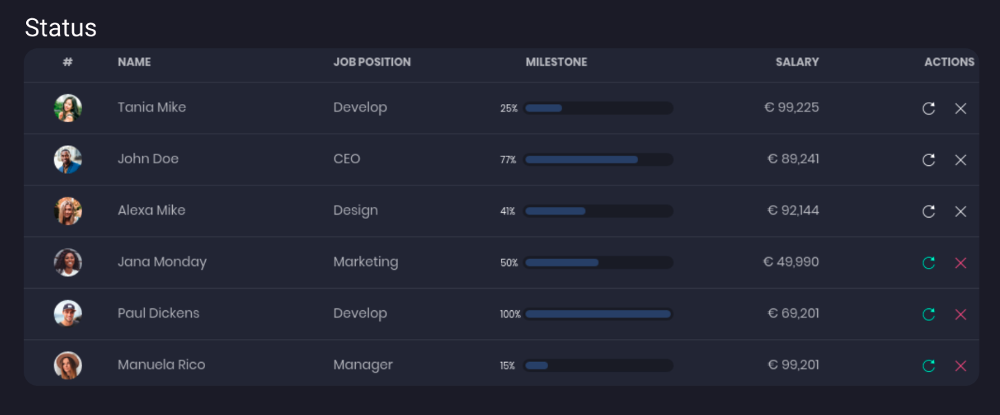  

### Tablet Version

---

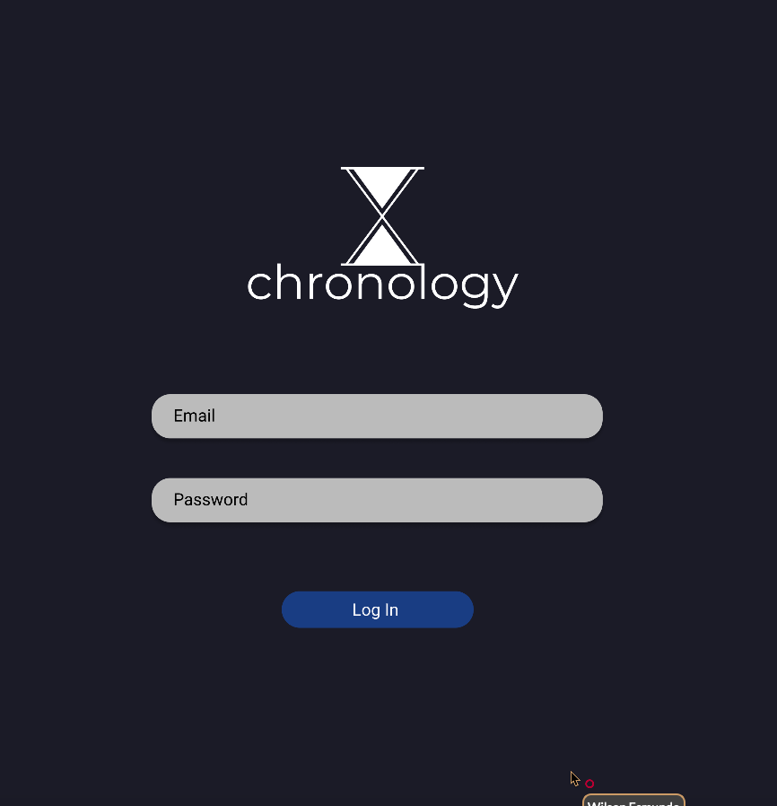  
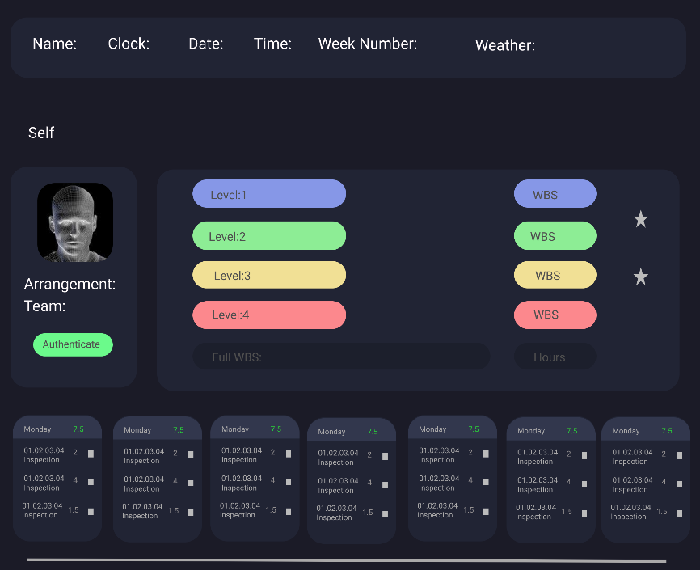  
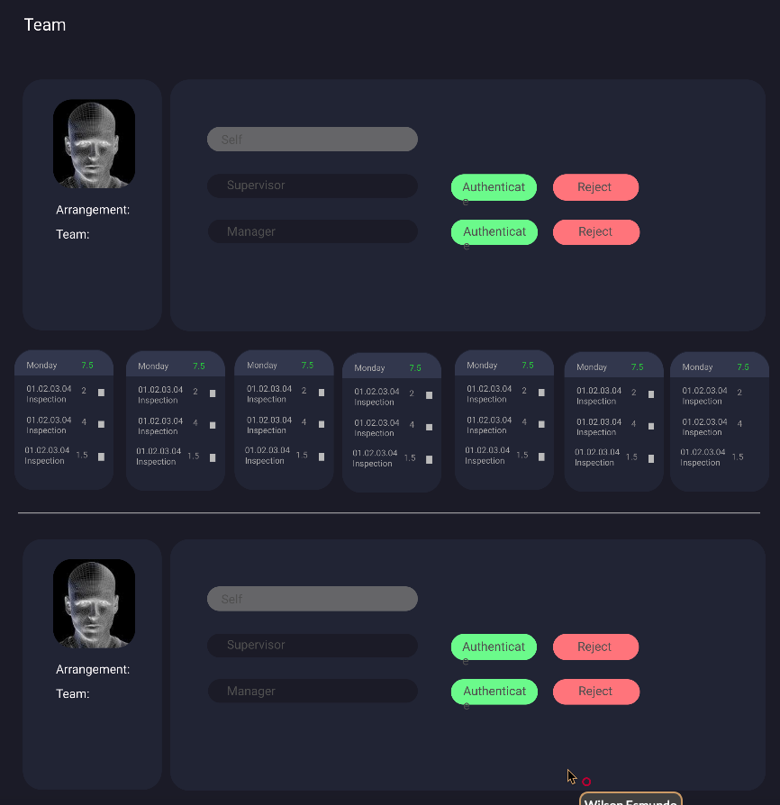  
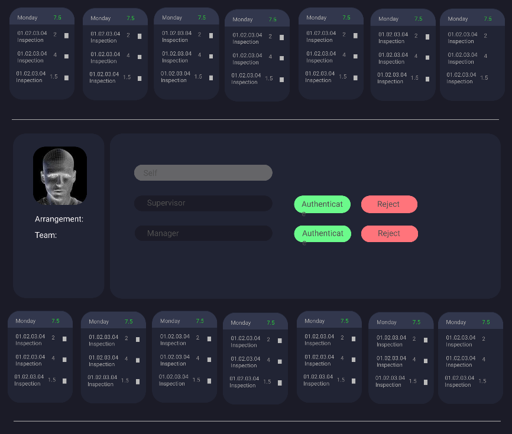  
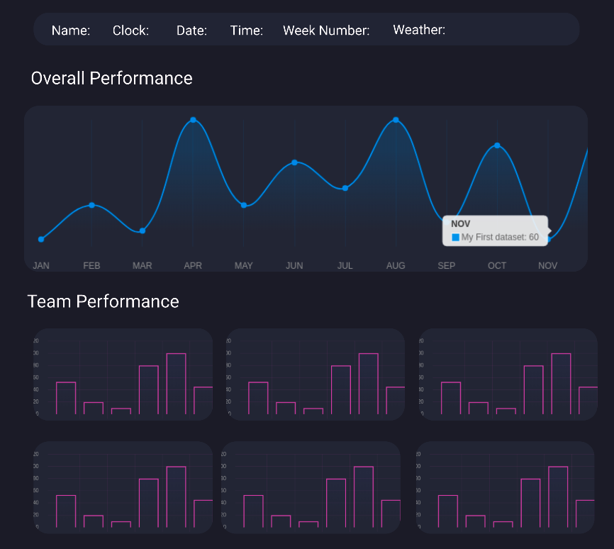  
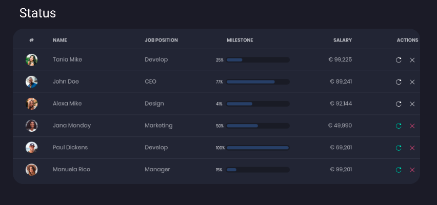  

### Mobile Version

---

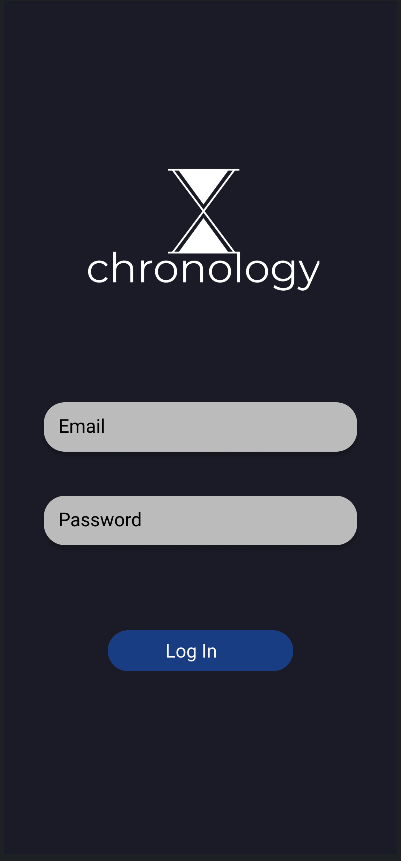  
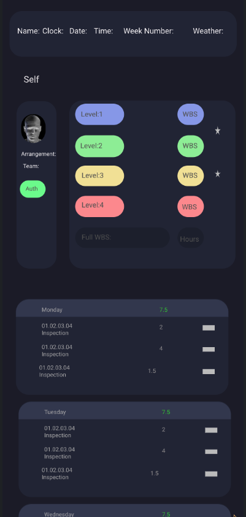  
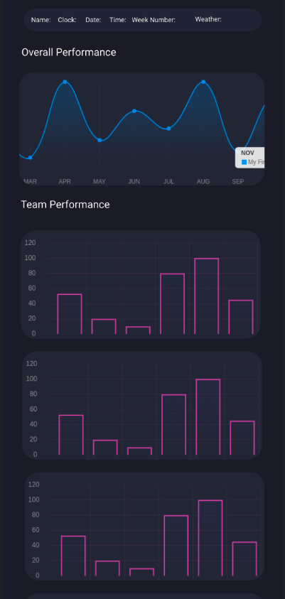  
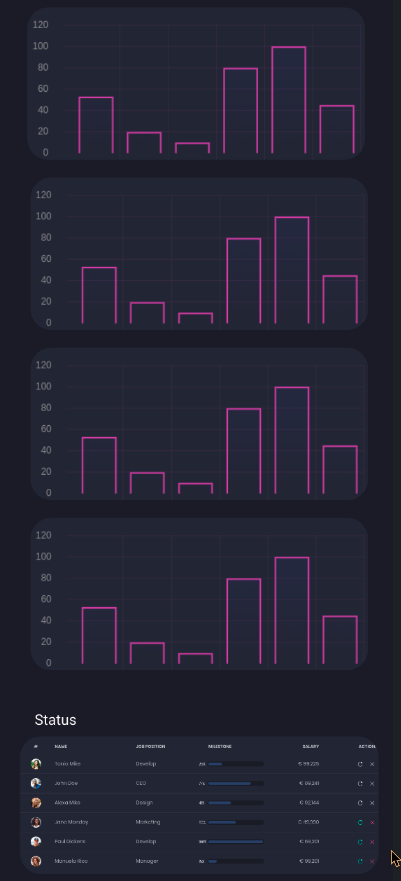  

## Screenshots of your Trello board demonstrating use throughout the initial stages of the project

---

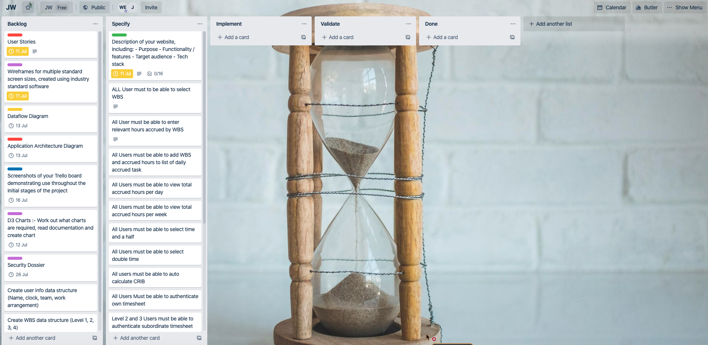  
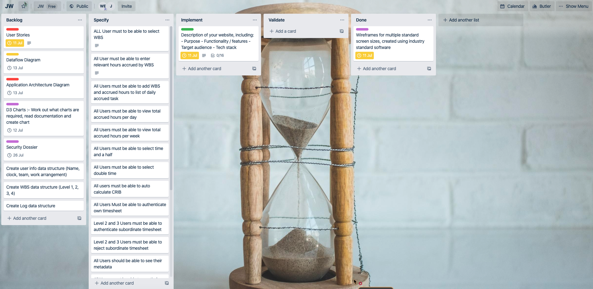  
